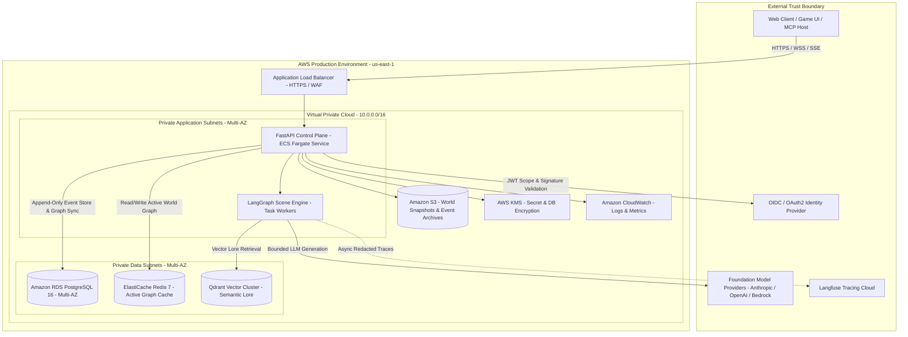
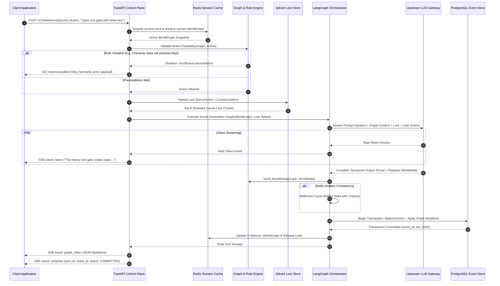
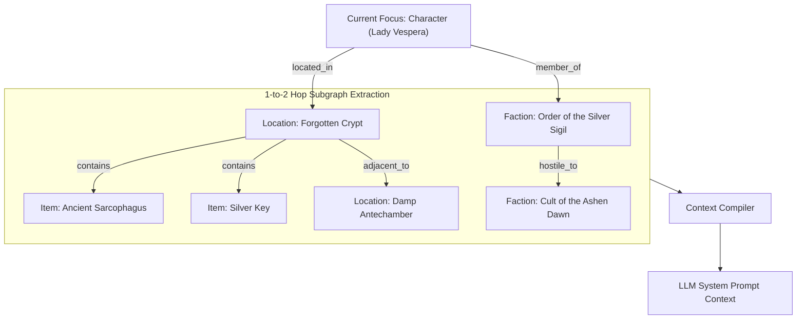
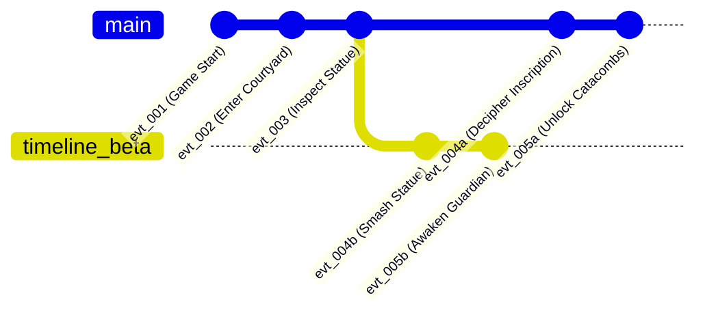

# Architecture: Narrative-Craft

**Status**: Proposed service architecture and system design specification. [Index](Index.md) · [Class](Class.md) · [Operations](Operations.md)

---

## 1. Boundaries and Topology

### Architectural Subsystems
1. **API Admission & Control Plane**: FastAPI application responsible for client authentication, request validation (Pydantic v2), rate limiting, and Server-Sent Events (SSE) multiplexing.
2. **Graph Engine & Deterministic Guardrails**: In-memory graph model (NetworkX adapter) backed by PostgreSQL. Evaluates physical causality rules (proximity, containment, accessibility) before and after narrative generation.
3. **LangGraph Scene Orchestrator**: Cyclic state graph that coordinates prompt construction, dynamic LLM generation, structured delta extraction, and reflection loops.
4. **Event-Sourced Multiverse Storage**: PostgreSQL stores an immutable, append-only log of every narrative event. Active world state is materialized into Redis and relational property tables. Snapshots are archived to Amazon S3.

---

## 2. Request & Turn Execution Lifecycle

The following sequence details how a narrative turn is admitted, validated, generated, committed, and streamed to the client:

---

## 3. Graph RAG & Spatial Neighborhood Extraction

Standard vector retrieval often fails in spatial and relational contexts (e.g. knowing who is in the room, what items are on the table, and who belongs to which hostile faction). Narrative-Craft implements **Graph-Augmented Generation (Graph RAG)**:

Before calling the LLM, the Graph Engine executes a bounded $k$-hop traversal ($k=2$) around the acting character. This generates a deterministic relational snapshot formatted as compact YAML in the prompt context, guaranteeing that the model only references entities physically or socially connected to the scene.

---

## 4. Event-Sourced Multiverse Branching Model

Narrative-Craft avoids mutable state corruption by modeling time as an immutable directed acyclic graph (DAG) of narrative events:

- **Root Timeline**: The canonical primary storyline.
- **Timeline Forking**: Calling `/v1/timelines/{id}/fork` takes an `event_id` snapshot pointer. A new child timeline record is created referencing the parent event without copying historical events.
- **Rollbacks**: Rolling back simply advances the active head pointer to an earlier event in the chain. Replays reconstruct state deterministically from the nearest cached snapshot.

---

## 5. Security, Authorization & Data Isolation

1. **Authentication & Multi-Tenant Isolation**: Every incoming request carries a verified JWT. Worlds and timelines belong to an `organization_id` or `user_id`. PostgreSQL Row-Level Security (RLS) ensures tenant data isolation at the database layer.
2. **Egress Guardrails**: Upstream calls to foundation models (Anthropic Claude, OpenAI GPT-4o, AWS Bedrock) pass through an egress proxy with strict timeout budgets (15s connect, 45s read) and prompt-injection sanitization.
3. **Data Protection**:
   - In-transit: TLS 1.3 enforced across all ALB, Redis, and PostgreSQL connections.
   - At-rest: AES-256 encryption via AWS KMS on RDS volumes, Redis clusters, and S3 snapshot buckets.

---

## 6. Deliberate Architectural Trade-offs

| Decision | Trade-off Benefit | Cost / Revisit Trigger |
| :--- | :--- | :--- |
| **Relational Graph in PostgreSQL vs. Neo4j** | ACID transactions across event log and graph tables; operational simplicity without managing two primary databases. | If graph queries exceed 4-hop depth or traversal latency exceeds 35ms under load, evaluate FalkorDB or Neo4j. |
| **NetworkX In-Memory Cache in Redis** | Sub-millisecond graph traversals and rule validations during active interactive turns. | Requires strict Redis memory budgeting and periodic write-through snapshot synchronization. |
| **Pre-Generation Deterministic Rule Validation** | Prevents invalid LLM hallucinations before spending tokens; guarantees physical causality. | Requires maintaining a deterministic rule registry in code alongside LLM prompts. |
| **Dual SSE Streaming (Tokens + Deltas)** | Allows game clients to animate text while updating 2D/3D visual maps in real time. | Requires client support for custom SSE event types (`token`, `graph_delta`, `complete`). |
