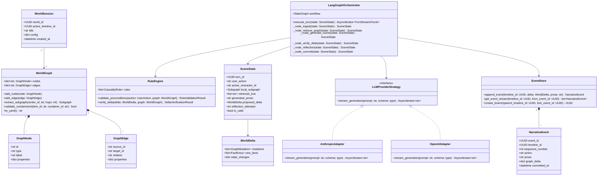
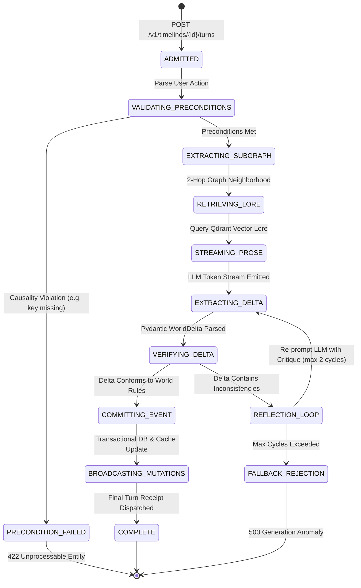

# Class & State Models: Narrative-Craft

**Status**: Implementation blueprint and component specification. [Index](Index.md) · [Architecture](Architecture.md) · [Operations](Operations.md)

---

## 1. Class Diagram & Component Responsibilities

---

## 2. Narrative Turn State Machine

The LangGraph orchestration lifecycle models the execution, self-correction, and streaming of each narrative interaction:

---

## 3. Core Software Design Patterns Applied

### 1. Strategy Pattern (`LLMProviderStrategy`)
Decouples prompt execution from concrete model vendors (Anthropic Claude 3.5 Sonnet, OpenAI GPT-4o, AWS Bedrock). Enables seamless fallback cascades if a primary provider encounters rate limits or upstream 5xx errors.

### 2. Repository & Unit-of-Work Pattern (`GraphRepository`, `EventStore`)
Isolates PostgreSQL DDL operations, recursive CTE traversals, and transactional outbox commits from domain logic. The Graph Engine interacts with domain entities (`GraphNode`, `GraphEdge`), while repositories handle serialization and SQL dialect details.

### 3. Event Sourcing Pattern (`EventStore`, `NarrativeEvent`)
Instead of directly overwriting database rows to update character locations or inventory counts, every state modification is recorded as an immutable delta event. The current world state is a projection of past events, enabling instantaneous branching and rollbacks.

### 4. Specification / Rule Pattern (`RuleEngine`, `CausalityRule`)
Encapsulates world logic rules (e.g. `CanTraverseEdgeRule`, `PossessesItemRule`, `DoorAccessibilityRule`) as individual, testable specification classes that execute without LLM involvement.
