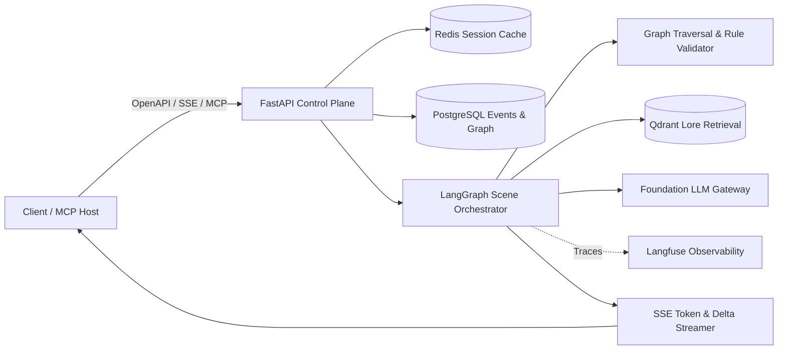

# Narrative-Craft

A headless, graph-augmented narrative simulation engine and stateful multiverse service designed to answer a fundamental creative AI question: **can an LLM generate rich, branching narrative scenes while mathematically preserving physical world rules, inventory causality, and historical canon consistency?**

This portfolio project demonstrates advanced AI systems architecture, asynchronous backend design, Graph-Augmented Generation (Graph RAG), and event-sourced state machines relevant to **AI Engineer**, **LLM Systems Engineer**, and **Backend AI / Applied AI Systems Architect** roles. It replaces naive conversational chatbots with an auditable, deterministic property graph, verified LangGraph cyclic agent loops, and Server-Sent Events (SSE) streaming.

**Status: Phase 2 architecture and documentation scaffolding. No production API or live AWS infrastructure is currently provisioned.** The OpenAPI 3.1 contracts, schema definitions, PostgreSQL DDL schemas, Docker compose environment, and multi-tier architectural specifications below are fully scaffolded and verified.

---

## Design at a glance



Python 3.12, FastAPI, AsyncIO, Pydantic v2, and OpenAPI 3.1 form the headless control plane. PostgreSQL 16 acts as the authoritative event store and relational property graph; Redis 7 provides low-latency active-session graphs; Qdrant supplies semantic lore embeddings; LangGraph drives cyclic scene generation and self-correcting delta reconciliation; Docker and Terraform define cloud delivery on AWS ECS Fargate.

---

## Planned API Consumption

These commands illustrate the consumption pattern against the headless service (`NARRATIVE_URL`).

### 1. Initialize a World Session
```bash
curl --fail-with-body -X POST "$NARRATIVE_URL/v1/worlds" \
  -H "Authorization: Bearer $NARRATIVE_TOKEN" \
  -H "Content-Type: application/json" \
  --data-binary @examples/create_world.json
# Returns 201 Created + JSON with world_id and root timeline_id
```

### 2. Execute a Turn with SSE Streaming (Tokens + Graph Deltas)
```bash
curl -N -X POST "$NARRATIVE_URL/v1/timelines/$TIMELINE_ID/turns" \
  -H "Authorization: Bearer $NARRATIVE_TOKEN" \
  -H "Content-Type: application/json" \
  -H "Accept: text/event-stream" \
  --data-binary @examples/narrative_turn_request.json
```
*Stream output delivers chunked literary tokens and structured JSON state mutations (`graph_delta`):*
```text
event: token
data: {"text": "You draw the silver key from your satchel and insert it into the rusted lock."}

event: graph_delta
data: {"mutations": [{"action": "UPDATE_EDGE", "source": "item_silver_key", "target": "gate_iron", "relation": "unlocked"}]}

event: complete
data: {"turn_id": "turn_01HXYZ...", "event_id": "evt_9981...", "status": "COMMITTED"}
```

### 3. Fork an Alternate Multiverse Timeline
```bash
curl --fail-with-body -X POST "$NARRATIVE_URL/v1/timelines/$TIMELINE_ID/fork" \
  -H "Authorization: Bearer $NARRATIVE_TOKEN" \
  -H "Content-Type: application/json" \
  --data-binary @examples/branch_timeline.json
# Returns 201 Created with new child timeline_id branched from exact event_id
```

---

## Available Locally

Run the complete local development environment using Docker Compose and Python scripts:

```powershell
# 1. Setup Python virtual environment and dependencies
python -m venv .venv
.venv\Scripts\python -m pip install -r requirements-dev.txt

# 2. Run automated scaffold and contract validation
.venv\Scripts\python scripts/validate_scaffold.py

# 3. Spin up local database, cache, and vector storage
Copy-Item .env.example .env
docker compose config --quiet
docker compose up -d postgres redis qdrant

# 4. Verify PostgreSQL relational graph schema
docker compose exec postgres psql -U narrative -d narrative_craft -c "\dt"

# 5. Teardown
docker compose down
```

---

## Engineering Proof & Next Steps

| Capability | Phase 2 Scaffolding Evidence | Phase 3 Implementation Proof |
| :--- | :--- | :--- |
| **API & Schema Contracts** | OpenAPI 3.1 specification, JSON Schemas, validated sample payloads | FastAPI route handlers, Pydantic v2 strict models, integration tests |
| **Graph-Augmented State** | Relational graph DDL schema with recursive CTE queries | NetworkX in-memory graph adapter with transactional PostgreSQL sync |
| **Deterministic Guardrails** | Pre-generation validation rule engine specification | Rule evaluation testbench rejecting invalid physical mutations |
| **Event Sourcing & Multiverse** | Event log schema, timeline branching & fork logic specification | Append-only event replay engine with snapshot caching |
| **Agentic Orchestration** | LangGraph state graph and reflection cycle specification | Live LLM integration with self-correcting delta schema enforcement |
| **Infrastructure as Code** | Terraform ECS Fargate, RDS, ElastiCache, S3 blueprints | Verified staging deployment with automated GitHub Actions CI/CD |

---

## Documentation Index & Deep Links

- **System Architecture**: [Architecture.md](Architecture.md) — Topology, request lifecycle, security, data flows
- **Class & State Machine Models**: [Class.md](Class.md) — LangGraph nodes/edges, design patterns, entity schemas
- **Technical Index**: [Index.md](Index.md) — Complete endpoint mapping, service specs, contracts
- **Operational Runbook**: [Operations.md](Operations.md) — Local development, telemetry, disaster recovery
- **Project Brief**: [PROJECT_BRIEF.md](PROJECT_BRIEF.md) — Product vision, constraints, and non-goals
- **Detailed Specifications**:
  - [API Conventions](docs/api/conventions.md)
  - [Turn Execution & Streaming](docs/api/turns.md)
  - [Timeline Branching & Multiverse](docs/api/timelines.md)
  - [Graph Engine & Rule Validation](docs/services/graph-engine.md)
  - [Orchestration State Machine](docs/services/orchestration.md)
  - [Cloud Deployment & Terraform](docs/delivery/deployment.md)
