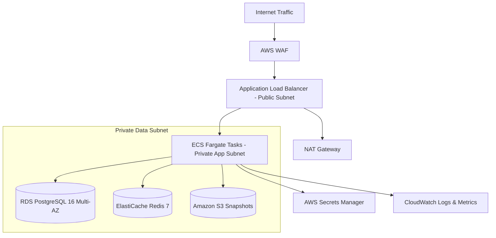

# Delivery Blueprint: AWS Production Cloud Deployment

## 1. Cloud Architecture Overview
Narrative-Craft is deployed to **Amazon Web Services (AWS)** using containerized serverless infrastructure to minimize operational overhead while guaranteeing high availability and security.

- **Compute**: AWS ECS Fargate running Python 3.12 containers in private VPC subnets.
- **Relational & Event Store**: Amazon RDS PostgreSQL 16 (Multi-AZ deployment) with encrypted EBS volumes.
- **Active In-Memory Cache**: Amazon ElastiCache Redis 7 (Cluster mode with replication).
- **Snapshot Storage**: Amazon S3 with SSE-KMS encryption and automated 90-day transition to Standard-IA.
- **Traffic Routing**: Application Load Balancer (ALB) terminating TLS 1.3 with AWS WAF protection.

## 2. Capacity Sizing & Cost Projections

| Component | Staging Tier | Production Tier | Purpose |
| :--- | :--- | :--- | :--- |
| **ECS Fargate Task** | 0.5 vCPU / 1 GB RAM (1 task) | 1.0 vCPU / 2 GB RAM (2–6 auto-scaled tasks) | FastAPI & LangGraph orchestrator |
| **RDS PostgreSQL** | `db.t4g.micro` (Single-AZ) | `db.r7g.large` (Multi-AZ, Provisioned IOPS) | Event store and relational property graph |
| **ElastiCache Redis** | `cache.t4g.micro` (Single node) | `cache.m7g.large` (Multi-AZ, 1 replica) | Active session locks and in-memory graphs |
| **Amazon S3** | Standard storage | Standard + Lifecycle to Standard-IA | Periodic world graph snapshot archives |

## 3. Security Hardening & Zero-Trust
1. **No Public IP Addresses**: ECS tasks and database instances reside exclusively in private subnets with no internet ingress.
2. **KMS Managed Keys**: All database storage, Redis caches, and S3 buckets are encrypted with customer-managed AWS KMS keys.
3. **IAM Least Privilege**: The ECS task execution role has access strictly restricted to pull container images from ECR and fetch application secrets from AWS Secrets Manager.
