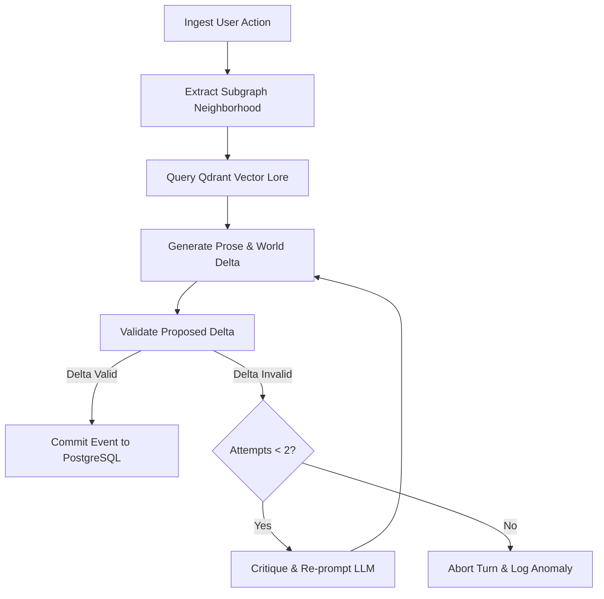

# Subsystem: LangGraph Scene Orchestrator

## 1. Overview
The narrative generation lifecycle is governed by an asynchronous **LangGraph** cyclic state machine. Rather than relying on a single prompt, the orchestrator divides scene creation into distinct, verifiable stages.

## 2. Graph Topology & State Transitions

## 3. Node Responsibilities

1. **`ingest_action`**: Extracts actor ID, action text, and declared intents from client payload.
2. **`extract_neighborhood`**: Invokes the Graph Engine to extract 2-hop spatial and relational context around the actor.
3. **`query_lore`**: Performs hybrid vector search against Qdrant to retrieve historical background, faction history, and world lore snippets.
4. **`generate_scene`**: Assembles system instructions, graph context, lore context, and recent history. Invokes the LLM using streaming, emitting prose tokens via SSE while capturing the structured `WorldDelta` output.
5. **`verify_delta`**: Runs the proposed `WorldDelta` through the deterministic `RuleEngine`. Checks for invalid mutations, impossible item transfers, or non-existent entity references.
6. **`critique_reflection`**: If the proposed delta violates graph rules, this node formats the exact violation message and instructs the model to correct its state delta without changing established facts.
7. **`commit_turn`**: Atomically inserts the event into `narrative_events`, applies graph mutations to `graph_nodes` and `graph_edges`, and broadcasts the final complete event.
